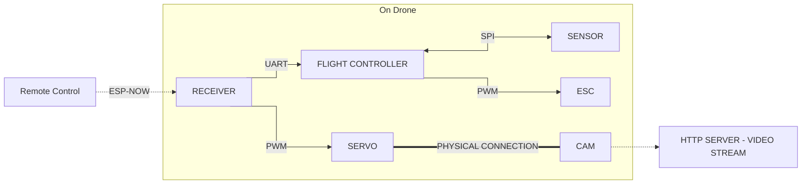

# multi-mcu-drone

#### Disclaimer
- Due to free profiles of HICPP and CPPCOREGUIDELINES in clang-tidy, this code is supposed to be taken as "HICPP-ish verified"
- **Current State:** Firmware for the STM32 board is partially tested on hardware - dma and uart are tested, spi is still **untested** (As of 22 Sept 2026)

## System overview
This firmware is written primarily in C++. The breakdown of the software modules for each specific board is detailed below:

- [esp32c6-rc](esp32c6-rc/) - Remote control module; handles gamepad input and transmits data wirelessly to the drone via the ESP-NOW protocol.
- [esp32c3-receiver](esp32c3-receiver/) - Receiver module; captures ESP-NOW packets, forwards them to the [stm32f4-main](stm32f4-main/) module via UART, and generates PWM signals for camera servo control.
- [esp32s3-cam](esp32s3-cam/) - Camera module; not implemented at this stage of development.
- [stm32f4-main](stm32f4-main/) - Main flight controller; serves as the brain of the drone, calculating PWM duty cycles for the motors based on UART RX data, accelerometer, and gyroscope inputs.

## Data flow

## Credits
- This project uses **[Bluepad32](https://github.com/ricardoquesada/bluepad32)** and its dependency **[BTStack](https://github.com/bluekitchen/btstack)** more about licensing and conditions in [LICENSE-3RD-PARTY](https://github.com/AlexWybranski/multi-mcu-drone/blob/master/LICENSE-3RD-PARTY.md)
